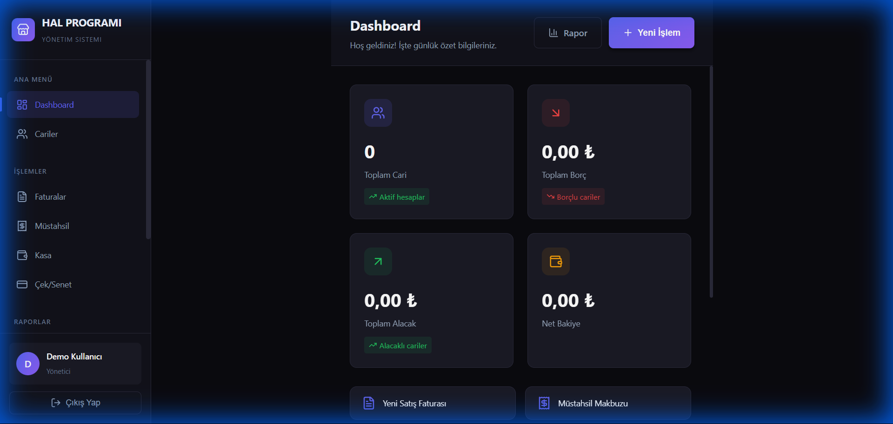

# 🍎 Hal Management System

A modern and user-friendly **Wholesale Fruit & Vegetable Market Management System**. Built with Electron, React, and TypeScript.


## 📋 Features

- 📊 **Dashboard** - Overview and statistics
- 👥 **Customer Management** - Track customers (Müstahsil, Firma, Diğer)
- 📄 **Account Statements** - Detailed account reports (Ekstre)
- 💰 **Cash Register** - Cash flow management (Kasa)
- 🧾 **Müstahsil İşlemleri** - Producer transaction handling with automatic calculation
- 🏢 **Satış Firmaları** - Sales management for companies
- 💳 **Check/Promissory Notes** - Payment tracking (Çek/Senet)
- 📈 **Reports** - Detailed reporting (Parti bazlı raporlar)
- ⚙️ **Settings** - System configuration

## 🛠️ Technologies

| Category | Technology |
|----------|------------|
| Framework | Electron 39 |
| Frontend | React 19, TypeScript 5 |
| Build Tool | electron-vite |
| Database | better-sqlite3 |
| UI Icons | Lucide React |
| Routing | React Router DOM |

## 🚀 Installation

### Prerequisites

- [Node.js](https://nodejs.org/) (v18 or higher)
- [npm](https://www.npmjs.com/) or [yarn](https://yarnpkg.com/)

### Steps

1. **Clone the repository**
   ```bash
   git clone https://github.com/YunusKok/Marketplace_System.git
   cd Marketplace_System
   ```

2. **Install dependencies**
   ```bash
   npm install
   ```

3. **Run in development mode**
   ```bash
   npm run dev
   ```

## 📦 Build & Packaging

You can package the application for different platforms using `electron-builder`:

```bash
# Windows (.exe)
npm run build:win

# macOS (.dmg)
npm run build:mac

# Linux (.deb, .rpm)
npm run build:linux
```

The build outputs will be available in the `dist` or `out` directory.

## 📁 Project Structure

```
hal-programi/
├── src/
│   ├── main/           # Electron main process
│   │   ├── index.ts    # Main entry point
│   │   ├── database.ts # Database operations
│   │   └── ipcHandlers.ts
│   ├── preload/        # Preload scripts
│   └── renderer/       # React application
│       └── src/
│           ├── pages/      # Page components
│           ├── components/ # Shared components
│           ├── hooks/      # Custom hooks
│           ├── styles/     # CSS styles
│           └── types/      # TypeScript types
├── resources/          # Application resources
├── build/              # Build configurations
└── package.json
```

## 🔧 Development Commands

| Command | Description |
|---------|-------------|
| `npm run dev` | Start development server |
| `npm run build` | Build the application |
| `npm run build:win` | Package for Windows |
| `npm run lint` | Code quality check |
| `npm run format` | Code formatting (Prettier) |
| `npm run typecheck` | TypeScript type checking |

## 📸 Screenshots

### Dashboard


## 📄 License

This project is licensed under the MIT License.

## 📞 Contact

[](https://www.linkedin.com/in/yunus-mert-kok)

---

⭐ Don't forget to star this project if you found it useful!
